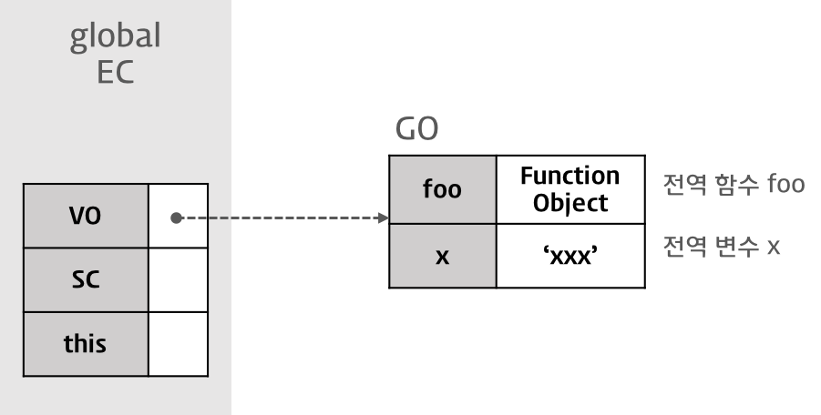
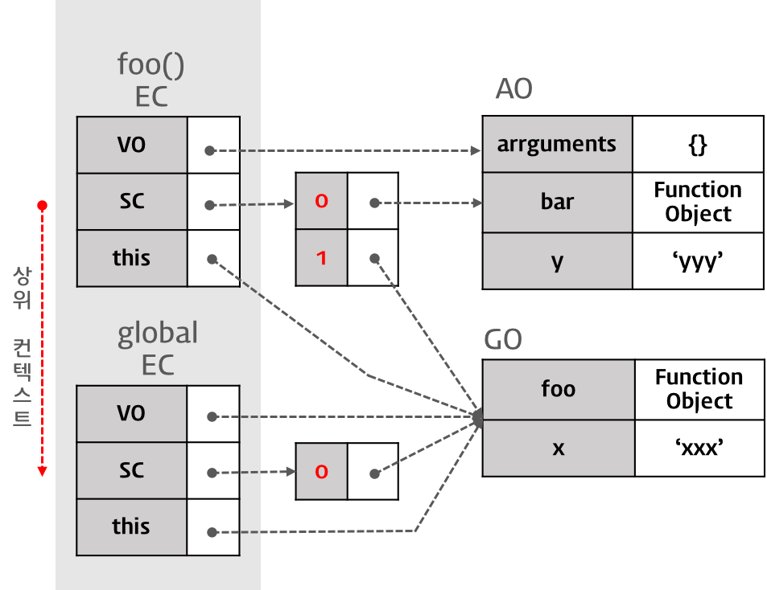

# Execution Context(실행 컨텍스트)

[이전 글로 이동하기 -> Arrow Function](../This/ArrowFunction.md)

### Execution Context(실행 컨텍스트)의 정의와 종류

**실행 컨텍스트**는 코드의 실행환경에 대한 여러가지 정보를 담고있는 것으로 좀 더 알기쉽게 표현하자면 `실행 컨텍스트는 실행 가능한 코드가 실행되기 위해 필요한 환경`이다.<br>

먼저 자바스크립트의 코드는 총 3가지로 이루어지는데 글로벌 스코프에 존재하는 `글로벌 코드`, eval함수 내에서 실행되는 `eval 코드`, 그리고 함수 스코프 내에 존재하는 `함수 코드`가 있다.<br>
(일반적으로 eval 코드는 컴파일최적화를 방해하기 때문에 일반적으로 많이 사용하는 글로벌 코드와 함수 코드를 다룬다.)<br>

그리고 자바스크립트 엔진은 위 3가지 코드를 실행하기 위해 각각의 실행 컨텍스트를 생성하게 된다.<br>

- 글로벌 실행 컨텍스트(**G**lobal **E**xecution **C**ontext)

- 함수 실행 컨텍스트(**F**untion **E**xecution **C**ontext)

- eval 실행 컨텍스트(일반적으로 사용x)

기억해야 하는 것은 자바스크립트 엔진이 코드를 실행하기 전에 `글로벌 실행 컨텍스트`를 생성한다는 것과 함수를 호출할 때마다 `함수 실행 컨텍스트`가 생성이 된다는 것이다.<br>

즉, 글로벌 실행 컨텍스트는 실행 이전에 생성이 되고 함수 실행 컨텍스트는 호출될 때 생성된다.<br>

```
var x = 'context1';

function foo () {
  var y = 'context2';

  function bar () {
    var z = 'context2';
    console.log(x + y + z);
  }
  bar();
}
foo();
```

위 코드를 실행하면 다음과 같이 실행 컨텍스트가 생성되고 소멸된다.<br>


코드가 실행되기 전에 글로벌 실행 컨텍스트가 쌓이고 함수가 호출되면 함수의 실행 컨텍스트가 쌓인다.<br>

함수 실행이 끝나면 함수 실행 컨텍스트가 제거되며 마지막으로 코드 실행이 종료되면 글로벌 실행 컨텍스트도 제거된다.<br>

이는 **LIFO(후입선출)** 의 구조를 따른다.<br>

### 실행 컨텍스트의 구성요소

실행 컨텍스트는 모두 다음과 같은 구성요소를 가집니다.<br>

**Lexical Environment**<br>

**Variable Environment**<br><br>

그리고 GEC와 FEC의 구성요소는 조금씩 다른데 어떻게 다른지 하나씩 비교해보겠습니다.<br>

- Lexical Environment

  Lexical Environment는 총 3가지로 구성되어 있습니다.

  1. Environment Record(V/O)

     실행 컨텍스트가 생성되면 자바스크립트 엔진은 실행에 필요한 여러 정보들을 담을 객체를 생성한다.

     이를 **Environment Record** 또는 **Varibale Object(V/O)** 라고 한다.

     Environment Record는 다음과 같은 정보를 담고 있다.

     - 변수

     - parameter or argument 정보

     - 함수 선언(함수 표현식 X)

     GEC의 Environment Record와 FEC의 Environment Record는 각각 전역 객체 / 활성 객체를 가르키는데 이는 GEC는 전역 코드와 함수 코드의 내용이 다르기 때문이다.

     그림으로 비교해보면 다음과 같다.

     - GEC의 E/R(V/O)

       

     - FEC의 E/R(V/O)

       

       그림과 같이 GEC는 parameter와 argument를 받을 수 있는 수단이 없이 때문에 제외되었다.

  2. Outer(Scope Chain)

     Outer(Scope Chain)는 외부 Lexical Environment를 참조하는 포인터로 전역 객체 또는 활성 객체의 리스트를 가리킨다.

     

     [Scope](../Scope/Scope.md) 글에서 Scope란 변수를 저장하고 찾는 규칙의 집합이라고 설명했었다.

     실제로 자바스크립트 엔진은 변수를 찾을 때 현재 스코프에서 찾는 것을 시도하고 실패할 시, 스코프 체인에 담겨있는 리스트 순서대로 점차 외부 스코프를 검색하게 되는데 바로 이것이 스코프 체인이라 불리는 이유이다.

  3. This Object

     This Object에는 동적으로 바인딩 되는 `this`객체의 정보가 담기게 된다.

- Variable Environment

  Variable Environment도 Lexical Environment와 동일하게 EnvironmentRecord / outer / thisbinding 에 대한 정보를 담고있지만 `var`로 선언된 변수만 저장한다는 점만 다르다.

  즉, Lexical Environment는 let과 const에 대한 변수 정보만 담는 반면 Variable Environment는 var에 대한 변수만 담는다.

### 실행 컨텍스트의 생성과 실행

실행 컨텍스트는 위 3가지 구성요소를 가지고 두 가지 단계(**생성단계** / **실행단계**)를 거친다.<br>

이해하기 쉽도록 다음 코드를 기반으로 하는 실행 컨텍스트 실행과정을 알아봅시다.<br>

```
let a = 10;
const b = 20;
var c;

function context1(d, e) {
  var f = 30;
  return context2() {
    console.log(a + b + d + e + f); // 90
  };
}

c = context1(10, 20);
c();
```

- GEC 생성단계

  코드 실행 전, 가장 먼저 GEC가 생성이 된다. 그리고 다음 순서대로 차례차례 실행이 된다.

  - Outer(Scope Chain)의 생성과 초기화

  - EnvironmentRecord(V/O) 생성과 초기화

    1. parameter와 argument값이 먼저 설정된다.

    2. 함수 선언 처리

    3. 변수 선언 처리

  - This Value 결정

  아래는 생성과정이 끝난 후의 GEC 상태이다.

  ```
  GlobalExecutionContextObject = {
    LexicalEnvironment: {
      EnvironmentRecord: {
        a: <uninitialized>,
        b: <uninitialized>,
        context1: <function>
      },
      outer: <null>,
      ThisBinding: <Global Object>
    },
    VariableEnvironment: {
      EnvironmentRecord: {
        c: undefined,
      },
      outer: <null>,
      ThisBinding: <Global Object>
    },
  }
  ```

  가장 먼저 스코프 체인부터 생성하고 초기화하는데 현재 GEC의 Scope는 최상위이기 때문에 outer로 참조할 값이 없어 null값이 초기화되었다.

  그 다음, 함수가 EnvironmentRecord 객체에 선언과 초기화되는데 이를 **함수 호이스팅** 이라고 한다.

  참고로 GEC 생성과 동시에 `context1` 함수는 [[Scopes]] 프로퍼티를 가지게 되는데 이는 자신의 실행환경과 자신을 포함하는 외부 함수의 실행 환경 및 글로벌 스코프를 가리키게 된다.

  

  덕분에 자신을 포함하는 외부 함수의 실행 컨텍스트가 소멸하여도 [[Scopes]] 프로퍼티가 가리키는 외부 환경의 스코프를 참조할 수 있는데 이것을 **클로저** 라고 합니다.

  그 뒤에 변수 선언이 EnvironmentRecord 객체에 선언과 초기화가 일어나며 잘 살펴보면 a,b 변수는 uninitalized로 선언이 되었지만 c변수는 undefined로 초기화 되어있다.

  이처럼 var변수만 undefined로 초기화되어있는데 이것이 바로 **변수 호이스팅** 이 일어난 것이다. let과 const는 var와 달리 변수 호이스팅이 일어나지 않는다.

  마지막으로 This Value가 결정되며 GEC의 경우 언제나 Global Object에 할당된다.

- GEC 실행단계

  GEC 실행

  ```
  GlobalExecutionContextObject = {
    LexicalEnvironment: {
      EnvironmentRecord: {
        a: 10,
        b: 20,
        context1: <function>
      },
      outer: <null>,
      ThisBinding: <Global Object>
    },
    VariableEnvironment: {
      EnvironmentRecord: {
        c: undefined,
      },
      outer: <null>,
      ThisBinding: <Global Object>
    },
  }
  ```

  변수 a와 b값이 할당되었으며 context함수가 호출이 이루어진다.

- FEC 생성단계

  GEC 실행단계가 진행되면서 context1함수가 호출되었다.

  FEC는 함수가 호출되면서 생성이 된다. 아래는 context1함수의 FEC이다.

  ```
  FunctionExecutionContextObject = {
    LexicalEnvironment: {
      EnvironmentRecord: {
        Arguments: {0: 10, 1: 20, length:2}
      },
      outer: <GlobalLexicalEnvironment>,
      ThisBinding: <Global Object or undefined>
    },
    VariableEnvironment: {
      EnvironmentRecord: {
        f: undefined
      },
      outer: <GlobalLexicalEnvironment>,
      ThisBinding: <Global Object or undefined>
    },
  }
  ```

  FEC 역시 GEC와 같은 순서대로 작동하며 GEC와 다른점은 Arguments 프로퍼티가 생겼다는 것인데 함수의 파라미터와 인자에 관한 정보를 가진다는 것.

  outer는 context1함수의 외부 스코프인 GlobalLexicalEnvironment를 참조하며 ThisBinding은 기본 바인딩이 적용되어 window 또는 undefined를 가진다.

- FEC 실행단계

  ```
  FunctionExecutionContextObject = {
    LexicalEnvironment: {
      EnvironmentRecord: {
        Arguments: {0: 10, 1: 20, length:2}
      },
      outer: <GlobalLexicalEnvironment>,
      ThisBinding: <Global Object or undefined>
    },
    VariableEnvironment: {
      EnvironmentRecord: {
        f: 30
      },
      outer: <GlobalLexicalEnvironment>,
      ThisBinding: <Global Object or undefined>
    },
  }
  ```

  f의 값이 할당되었다.

  그리고 다음은 context1과 context2 함수의 실행이 종료된 바로 후의 GEC이다.

  ```
  GlobalExecutionContextObject = {
    LexicalEnvironment: {
      EnvironmentRecord: {
        a: 10,
        b: 20,
        context1: <function>
      },
      outer: <null>,
      ThisBinding: <Global Object>
    },
    VariableEnvironment: {
      EnvironmentRecord: {
        c: <function>,
        context1: <function>
      },
      outer: <null>,
      ThisBinding: <Global Object>
    },
  }
  ```

  c값이 context2 함수로 할당되었으며 c함수가 호출되면 c함수가 생성되고 실행되는 단계를 거치며 `90`이라는 결과값을 출력 후 종료한다.

  모든 코드 실행을 마쳤으면 마지막으로 GEC도 실행 스택에서 제거된 뒤 프로그램이 종료된다.

실행 컨텍스트는 보다시피 자바스크립트 엔진이 코드를 실행하기 위한 환경을 참조하며 그 환경에는 지금까지 배워왔던 스코프, 호이스팅, 클로저, this바인딩 등이 어떻게 적용되고 참조할 수 있는지에 대한 정보를 모두 담고 있는 중요한 개념입니다.<br>

참고 -> [PoimaWeb / Context](https://poiemaweb.com/js-execution-context)<br>
참고 -> [imacoolgiryo님의 EC 소개 글](https://velog.io/@imacoolgirlyo/JS-%EC%9E%90%EB%B0%94%EC%8A%A4%ED%81%AC%EB%A6%BD%ED%8A%B8%EC%9D%98-Hoisting-The-Execution-Context-%ED%98%B8%EC%9D%B4%EC%8A%A4%ED%8C%85-%EC%8B%A4%ED%96%89-%EC%BB%A8%ED%85%8D%EC%8A%A4%ED%8A%B8-6bjsmmlmgy)<br>

[다음 글로 이동하기 -> Prototype](../Prototype/Prototype.md)
