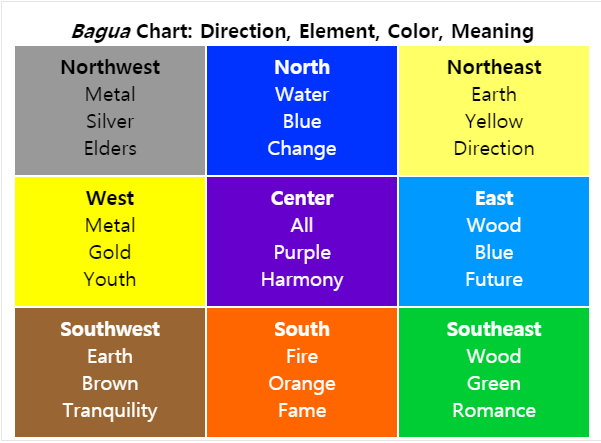

# 이벤트 위임

[이전 글로 이동하기 -> 이벤트 캡처링과 버블링](./Capturing-Bubbling.md)

### 이벤트 핸들링 패턴

캡처링과 버블링을 사용하면 강력한 이벤트 핸들링 패턴인 **이벤트 위임** 을 구현할 수 있습니다.<br>

먼저, 이벤트 캡처링과 버블링을 설명하기 위해 사용한 코드를 잠시 살펴보겠습니다.<br>

```
<form onclick="alert('form')">FORM
  <div onclick="alert('div')">DIV
    <p onclick="alert('p')">P</p>
  </div>
</form>
```

보다시피 클릭 이벤트가 비슷한 방식으로 처리되고 있지만 세개 요소에 각각 클릭 이벤트를 할당하는 것은 굉장히 번거로울 뿐만 아니라 비효율적입니다.<br>

`이벤트 위임은 위처럼 이벤트가 필요한 곳마다 핸들러를 등록 시키는 것이 아니라 요소의 공통 조상에 이벤트 핸들러를 하나만 등록하고 하나의 이벤트 핸들러로 모든 요소를 컨트롤하는 것을 말합니다.`<br>

이것이 가능한 이유는 공통 조상에 할당된 핸들러에서 `event.target`을 활용하면 실제 어디서 이벤트가 발생했는지 알 수 있기 때문에 가능한 것 입니다.<br>

#### 이벤트 핸들링 HTML 코드

```
<table>
  <tr>
    <th colspan="3"><em>Bagua</em> Chart: Direction, Element, Color, Meaning</th>
  </tr>
  <tr>
    <td class="nw"><strong>Northwest</strong><br>Metal<br>Silver<br>Elders</td>
    <td class="n">...</td>
    <td class="ne">...</td>
  </tr>
  <tr>...2 more lines of this kind...</tr>
  <tr>...2 more lines of this kind...</tr>
</table>
```

하나의 테이블이 존재하고 테이블 안에 9개의 박스가 있습니다.<br>



우리가 할 것은 테이블 안의 td태그를 클릭했을 때, 그 칸의 색을 강조하는 것 입니다.<br>

이벤트 위임을 활용하기 위해 공통 조상인 table 태그에 이벤트 핸들러를 등록하고 event.target을 이용해 어떤 요소가 클릭되었는지 확인하여 해단 칸을 강조해보겠습니다.<br>

코드는 아래와 같습니다.

#### 이벤트 핸들링 JavaScript 코드

```
let selectedTd;

table.onclick = function(event) {
  let target = event.target; // 클릭이 어디서 발생했을까요?

  if (target.tagName != 'TD') return; // TD에서 발생한 게 아니라면 아무 작업도 하지 않습니다,

  highlight(target); // 강조 함
};

function highlight(td) {
  if (selectedTd) { // 이미 강조되어있는 칸이 있다면 원상태로 바꿔줌
    selectedTd.classList.remove('highlight');
  }
  selectedTd = td;
  selectedTd.classList.add('highlight'); // 새로운 td를 강조 함
}
```

보다시피 하나의 이벤트에서 event.target이 TD태그라면 강조효과를 넣어 여러 요소를 이벤트 핸들링 할 수 있게 되었습니다.<br>

하지만 위 HTML 코드에서 이러한 코드가 있다는 것이 이벤트 위임을 막을 수 있습니다.<br>

`<td class="nw"><strong>Northwest</strong><br>Metal<br>Silver<br>Elders</td>`<br>

만약 td태그 안의 strong 태그를 클릭하게 된다면 `selectedId`는 strong 태그가 될 것이며 td태그에 강조가 되는 것이 아니라 strong태그에 될 것 입니다.<br>

이는 버블링이 잘 동작하고 있기 때문에 strong태그가 event.target이 되는 것 입니다.<br>

하지만 우리는 이러한 작동방식을 원하지 않습니다. 오로지 td태그에만 강조효과를 넣고 싶다면 어떻게 해야 하나요?<br>

아래는 이 단점을 보완한 코드입니다.<br>

```
table.onclick = function(event) {
  let td = event.target.closest('td'); // (1)

  if (!td) return; // (2)

  if (!table.contains(td)) return; // (3)

  highlight(td); // (4)
};
```

(1) event.target.closest 메서드는 클릭된 타겟 요소로부터 가장 가까운 상위 td태그를 찾아 반환합니다.<br>

(2) 만약 event.target이 td안에서 발생한 것이 아니라면 함수를 종료할 것 입니다.<br>

(3) 또한 table안에 있는 td가 아닌 바깥 요소의 td를 찾을수도 있으므로 방지해줘야 합니다.<br>

(4) td태그가 존재한다면 강조해봅시다.<br><br>

요약해 봅시다.<br>

이벤트 위임은 이벤트 핸들링을 할 수 있는 강력한 패턴으로 유사한 요소에 동일한 핸들러를 적용하고 싶을 때 유용하게 사용할 수 있습니다.<br>

**이벤트 위임은 핸들링할 요소들의 상위 요소에 하나의 핸들러를 할당하고 event.target을 이용해 원하는 요소에서 이벤트가 발생했을 때 이벤트를 핸들링하는 방식입니다.<br>**

이벤트 위임은 많은 핸들러를 할당하지 않아도 되기 때문에 메모리가 절약된다는 장점과 요소를 추가하거나 제거할 때 따로 이벤트 핸들러를 추가하거나 제거해주지 않아도 된다는 장점이 존재합니다.<br>

하지만 이벤트 위임을 사용하려면 반드시 이벤트가 버블링 되어야 하는데 몇몇 이벤트는 버블링이 되지 않는 경우가 있어 잘 확인하고 사용하여야 한다는 단점도 존재합니다.<br>

참고 -> [모던 자바스크립트 이벤트 위임](https://ko.javascript.info/event-delegation)
